# DIS Integration Samples
This project contains sample implementation of common [online identity verification](https://developers.innovatrics.com/digital-onboarding/docs/use-cases/onboarding/) use cases for [Digital Identity Service (DIS)](https://developers.innovatrics.com/digital-onboarding/technical/remote/dot-dis/latest/documentation/) server component.
All samples can run independently. Project is implemented using Java/Gradle build and REST Client generated from [OpenAPI (Swagger) definition](https://innovatrics.github.io/dot-digital-identity-service/?url=https://raw.githubusercontent.com/innovatrics/dot-digital-identity-service/master/api/swagger.json).

## Available Samples
1. [Actuator Info and Health](#actuator-info-and-health)
2. [Check Supported Documents and their Metadata](#check-supported-documents-and-their-metadata)
3. [Check Documents Quality](#check-documents-quality)
4. [Use Documents Advice](#use-documents-advice)
5. [Read Only MRZ Data from Document or Unsupported Document](#read-only-mrz-data-from-document-or-unsupported-document)
6. [Evaluate Passive Liveness](#evaluate-passive-liveness)
7. [Evaluate Eye-gaze Liveness](#evaluate-eye-gaze-liveness)
8. [Comprehensive Customer Onboarding Workflow](#comprehensive-customer-onboarding-workflow)
9. [Customer Inspect and Document Inspect](#customer-inspect-and-document-inspect)
10. [Create and Detect Face](#create-and-detect-face)
11. [Evaluate Faces Similarity (Face to Face)](#evaluate-faces-similarity-(face-to-face))
12. [Check Face Aspects](#check-face-aspects)
13. [Create Face Image Crops](#create-face-image-crops)
14. [Evaluate Face Image Quality](#evaluate-face-image-quality)
15. [Check of Face Wearables (face mask, glasses, etc.)](#check-of-face-wearables-(face-mask,-glasses,-etc.))

## Build and Run
You can use attached Gradle wrapper for build and run of samples.
Build task will also create and build API client files from attached `swagger.json`.

For project build run:
```shell
./gradlew clean build
```

Application can be configured by modifying properties in file `./src/main/resources/application.properties`.  
Mostly you will use:
```properties
dot-identity-service-url=url_address_of_running_dot_identity_service
sample-image-url=url_adress_of_image_to_use_in_samples
similarity.probe.sample-image-url=url_adress_of_image_to_use_in_similarity_samples_as_probe
similarity.reference.sample-image-url=url_adress_of_image_to_use_in_similarity_samples_as_reference
```

## API Authentication
The **Digital Identity Service API** is secured with an API Key authentication, therefore you will need to send an HTTP Authorization header with every request.
Please follow our developers' documentation for detail information: [LINK](https://developers.innovatrics.com/digital-onboarding/technical/remote/dot-dis/latest/documentation/#_authentication)

# Samples Description
## Monitoring Samples
#### Actuator Info and Health
This sample shows how Actuator Info (`/info`) and Health (`/heath`) endpoints can be used to check and monitor
if application is running, application version, date of license expiration or internal libraries version.
These two endpoints do not need authentication.

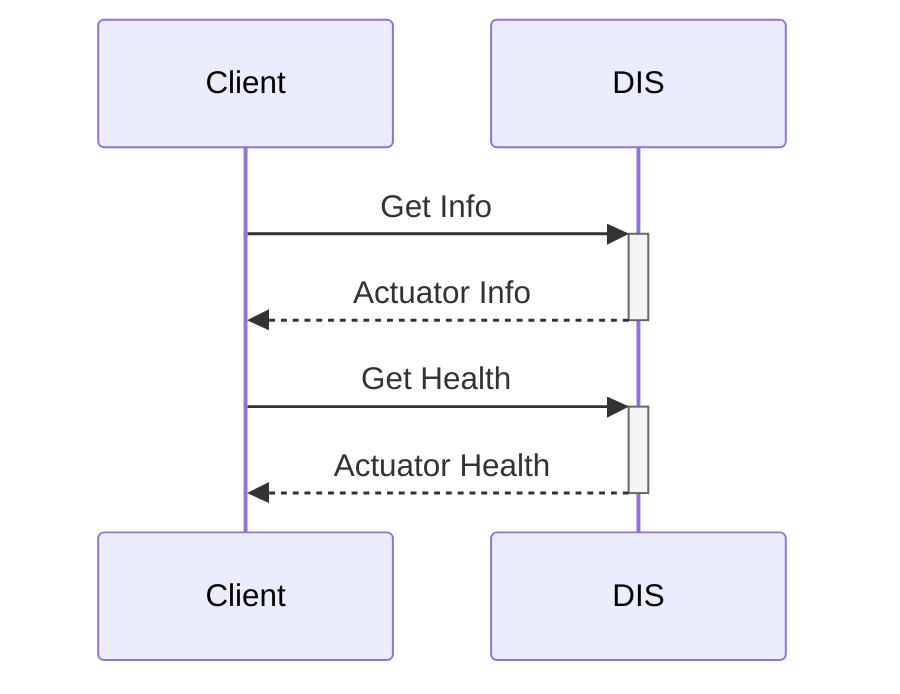
```mermaid
sequenceDiagram
    participant Client
    participant DIS

    Client->>+DIS: Get Info
    DIS-->>-Client: Actuator Info
    Client->>+DIS: Get Health
    DIS-->>-Client: Actuator Health
```

## Workflows on Customer Onboarding API
### Documents Handling Samples
#### Check Supported Documents and their Metadata
This sample shows how Documents Metadata (`/metadata`) endpoint can be used to check supported ID documents,
their type, edition, fields which can be read from document and information if portrait is presented on document.

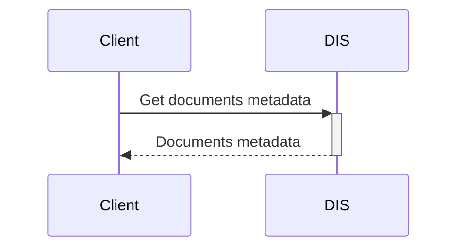
```mermaid
sequenceDiagram
    participant Client
    participant DIS

    Client->>+DIS: Get documents metadata
    DIS-->>-Client: Documents metadata
```

#### Check Documents Quality
This sample shows how to check ID document image quality and evaluate if document is usable for [OCR text extraction](https://developers.innovatrics.com/digital-onboarding/docs/functionalities/document/ocr/)
or if image has key issues which can cause incorrect classification, incorrect data reading or other issues caused mostly by hotspots, sharpness, brightness, etc.

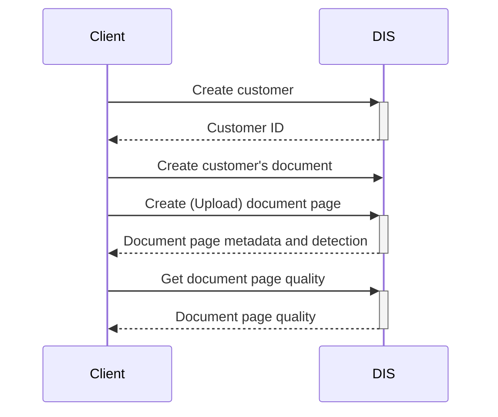
```mermaid
sequenceDiagram
    participant Client
    participant DIS

    Client->>+DIS: Create customer
    DIS-->>-Client: Customer ID
    Client->>DIS: Create customer's document
    Client->>+DIS: Create (Upload) document page
    DIS-->>-Client: Document page metadata and detection
    Client->>+DIS: Get document page quality
    DIS-->>-Client: Document page quality
```

#### Use Documents Advice
This sample shows how to correctly use documents advice to decrease set of documents during classification phase of document recognition.
If document advice is used correctly it can decrease time needed for document classification and also avoid incorrect classification of document.
By document advice it is also possible to limit sources of data in case that you only need document portrait, MRZ zone, barcodes, etc.
which can also decrease time needed for whole document processing.

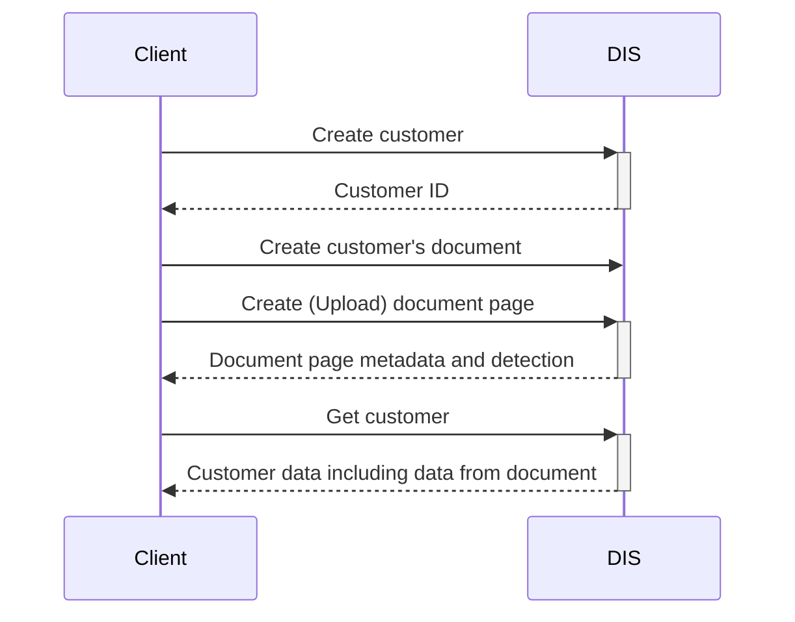
```mermaid
sequenceDiagram
    participant Client
    participant DIS

    Client->>+DIS: Create customer
    DIS-->>-Client: Customer ID
    Client->>DIS: Create customer's document
    Client->>+DIS: Create (Upload) document page
    DIS-->>-Client: Document page metadata and detection
    Client->>+DIS: Get customer
    DIS-->>-Client: Customer data including data from document
```

#### Read Only MRZ Data from Document or Unsupported Document
This sample shows how to use documents source if you are interested to only some subset of data from document.
By setting up document source you can limit sources of data in case that you only need document portrait, MRZ zone, barcodes, etc.
This approach can be handy if working with unsupported documents to avoid misclassification, in case that you are interested in only document portrait or vice versa you do not care about document portrait, MRZ or barcodes.
Limiting document source can also decrease time needed for whole document processing.


```mermaid
sequenceDiagram
    participant Client
    participant DIS

    Client->>+DIS: Create customer
    DIS-->>-Client: Customer ID
    Client->>DIS: Create customer's document
    Client->>+DIS: Create (Upload) document page
    DIS-->>-Client: Document page metadata and detection
    Client->>+DIS: Get customer
    DIS-->>-Client: Customer data including data from document
```

### Liveness Evaluation Samples
#### Evaluate Passive Liveness
This sample sends detection request for image under `sample-image-url` and evaluates score for [passive liveness detection](https://developers.innovatrics.com/digital-onboarding/docs/functionalities/face/passive-liveness-check/).

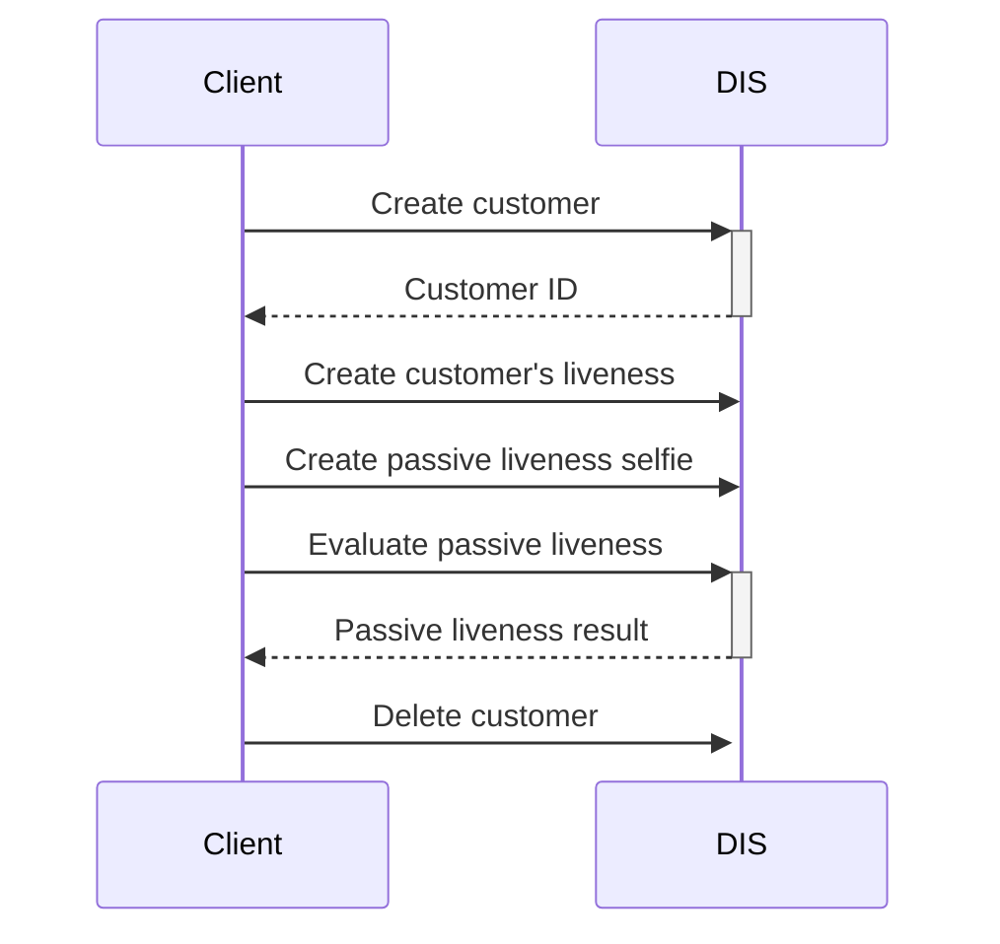
```mermaid
sequenceDiagram
    participant Client
    participant DIS

    Client->>+DIS: Create customer
    DIS-->>-Client: Customer ID
    Client->>DIS: Create customer's liveness
    Client->>DIS: Create passive liveness selfie
    Client->>+DIS: Evaluate passive liveness
    DIS-->>-Client: Passive liveness result
    Client->>+DIS: Delete customer
```

#### Evaluate Eye-gaze Liveness
Eye gaze liveness evaluates (a method of [active liveness detection](https://developers.innovatrics.com/digital-onboarding/docs/functionalities/face/active-liveness-check/)) if live person photos are captured by detecting direction in which eyes are looking at image.
After liveness is started and assigned ID, we can send series of photos with assigned position at which faces on them
are supposed to be looking. After enough pictures are used (at least 4 including multiple positions), evaluation is called
returning liveness score. Photos used in this sample can be found in resources under `images/faces` directory.

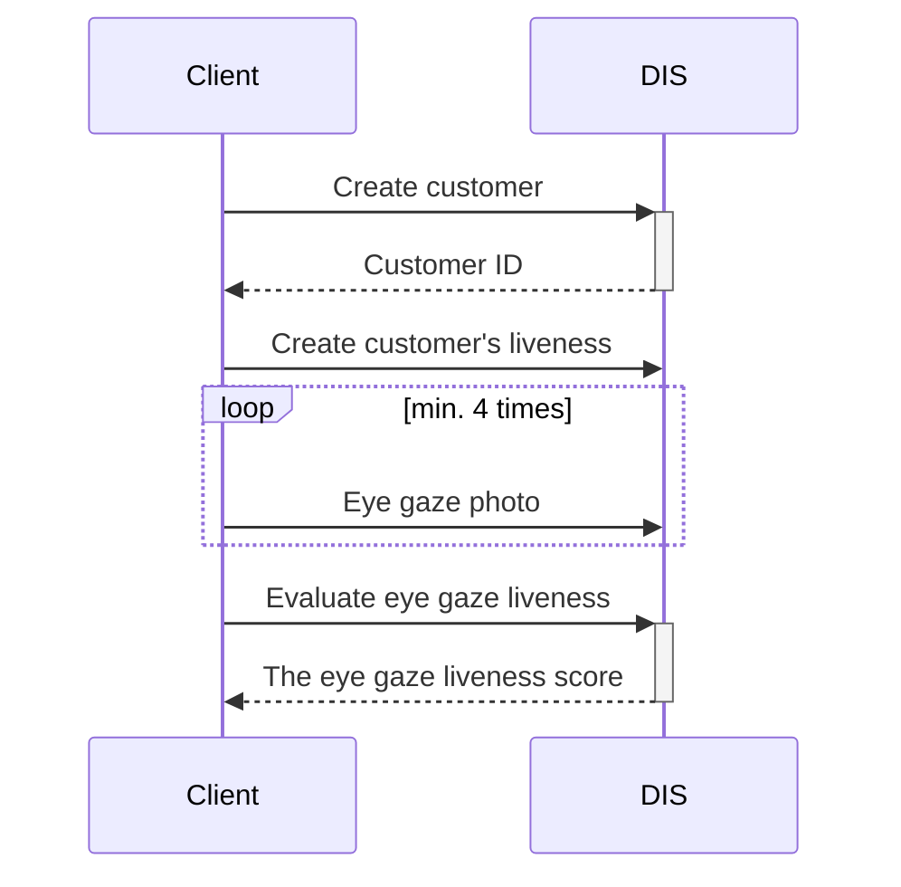
```mermaid
sequenceDiagram
    participant Client
    participant DIS

    Client->>+DIS: Create customer
    DIS-->>-Client: Customer ID
    Client->>DIS: Create customer's liveness
    loop min. 4 times
        Client->>DIS: Eye gaze photo
    end
    Client->>+DIS: Evaluate eye gaze liveness
    DIS-->>-Client: The eye gaze liveness score
```

### Comprehensive Customer Onboarding Workflow
Customer onboarding serves for creating a digital identity of an individual called a customer. Onboarding aggregates all the
data supplied by the client like selfies or document images which can be later used for inspecting the customer. This data is
processed, the face is detected on the selfie, the document is classified, normalized and OCR is performed. Data is structured
for straightforward inspection of the customer. Onboarding flow is customizable and only portion of the data can be supplied
meeting the integrator's needs.  
Following operations can be performed on the customer's data.  
Sample flow is shown in the sequence diagram below.

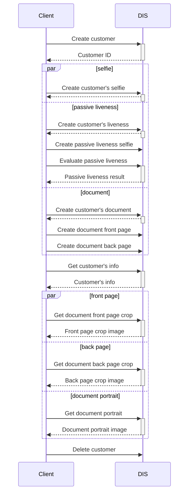
```mermaid
sequenceDiagram
    participant Client
    participant DIS

    Client->>+DIS: Create customer
    DIS-->>-Client: Customer ID
    par selfie
    Client->>+DIS: Create customer's selfie
    DIS-->>-Client:
    and passive liveness
    Client->>+DIS: Create customer's liveness
    DIS-->>-Client:
    Client->>DIS: Create passive liveness selfie
    Client->>+DIS: Evaluate passive liveness
    DIS-->>-Client: Passive liveness result
    and document
    Client->>+DIS: Create customer's document
    DIS-->>-Client:
    Client->>DIS: Create document front page
    Client->>DIS: Create document back page
    end
    Client->>+DIS: Get customer's info
    DIS-->>-Client: Customer's info
    par front page
    Client->>+DIS: Get document front page crop
    DIS-->>-Client: Front page crop image
    and back page
    Client->>+DIS: Get document back page crop
    DIS-->>-Client: Back page crop image
    and document portrait
    Client->>+DIS: Get document portrait
    DIS-->>-Client: Document portrait image
    end
    Client->>DIS: Delete customer   
```

### Customer Inspect and Document Inspect
This sample is based on Comprehensive Customer Onboarding Workflow described above and extend it with more information based on all data collected during onboarding process.
There are two endpoints used for inspection of data consistency.
Customer Inspect `/inspect` is based around customer face and will provide you information mostly about selfie, liveness,
face verification across all photos (including document portrait), gender and age based on photos (including document portrait) and other data.
Document Inspect `/document/inspect` is based around documents data and will provide you information mostly about document validity,
MRZ checksums validity, quality, data consistency, gender and age based on document portrait (including selfie and liveness) and other data.

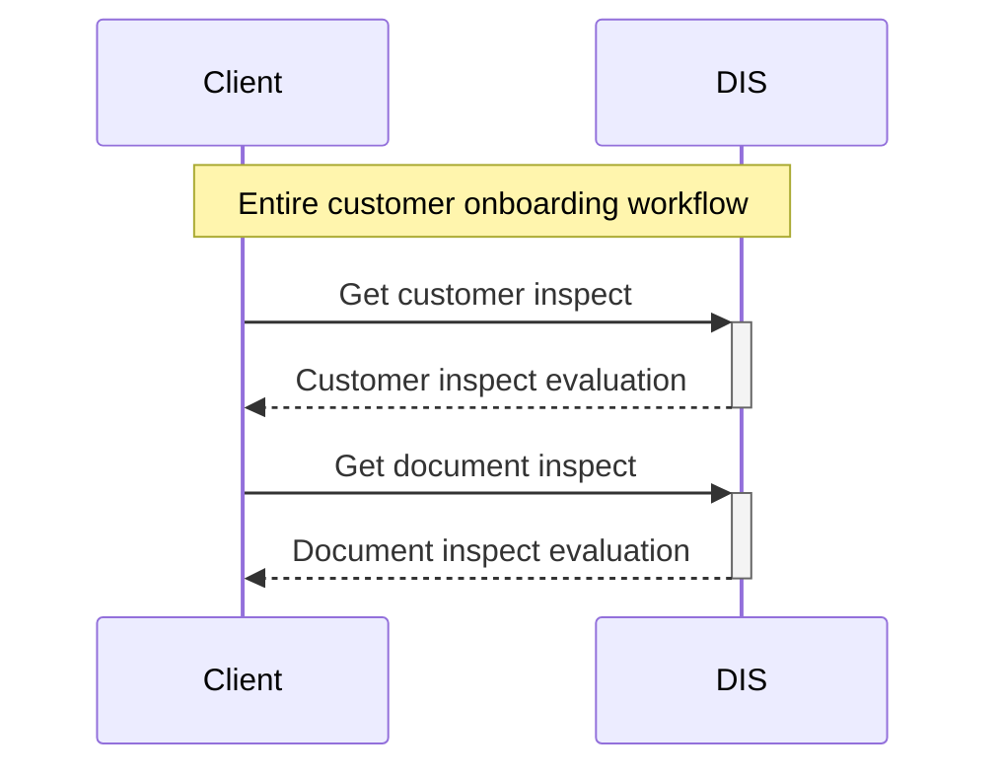
```mermaid
sequenceDiagram
    participant Client
    participant DIS

    Note over Client,DIS: Entire customer onboarding workflow
    Client->>+DIS: Get customer inspect
    DIS-->>-Client: Customer inspect evaluation
    Client->>+DIS: Get document inspect
    DIS-->>-Client: Document inspect evaluation
```

## Workflows on Face Operations API

#### Create and Detect Face
This sample shows basic [face detection](https://developers.innovatrics.com/digital-onboarding/docs/functionalities/face/detection/) which is base for all other face related functionality. Image with face is
provided either as URL (has to be accessible by DIS server and contain image) or as Image bytes
(coded in Base64 for request). Here, file in resources named `images/faces/face.jpeg` and url `sample-image-url` is used.
If detection call was successful, confidence score and additional information about face are returned.
At the end faces are deleted to free up MCache space before its expiration.

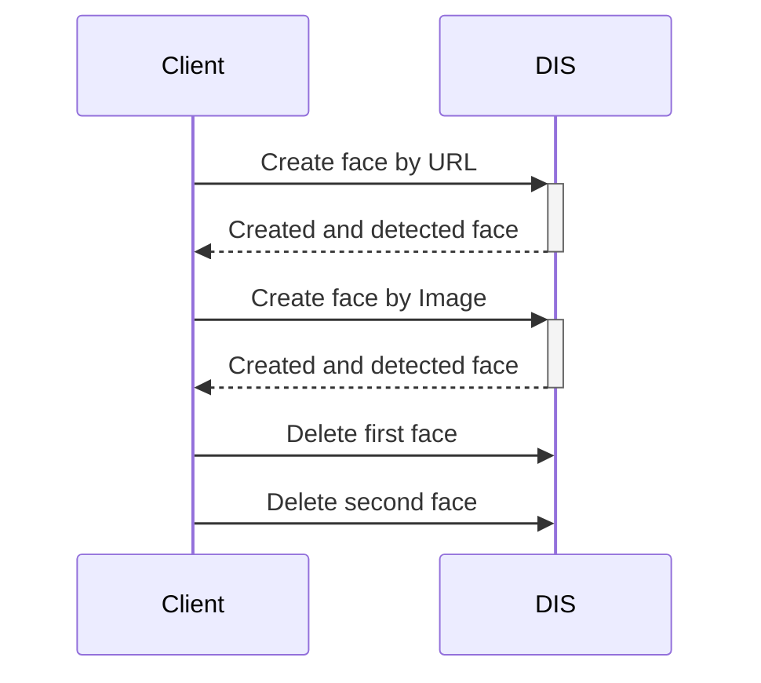
```mermaid
sequenceDiagram
    participant Client
    participant DIS

    Client->>+DIS: Create face by URL
    DIS-->>-Client: Created and detected face
    Client->>+DIS: Create face by Image
    DIS-->>-Client: Created and detected face
    Client->>DIS: Delete first face
    Client->>DIS: Delete second face
```

#### Evaluate Faces Similarity (Face to Face)
This sample for [face matching](https://developers.innovatrics.com/digital-onboarding/docs/functionalities/face/matching/) compares reference photo under `similarity.reference.sample-image-url` to  probe photo under
`similarity.probe.sample-image-url` and returns score representing similarity of probe to reference.

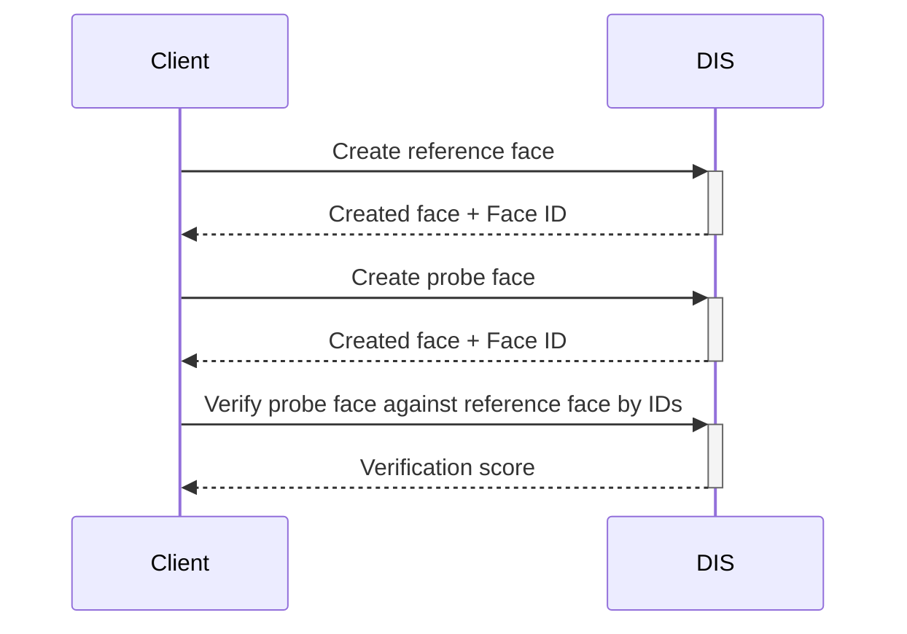
```mermaid
sequenceDiagram
    participant Client
    participant DIS

    Client->>+DIS: Create reference face
    DIS-->>-Client: Created face + Face ID
    Client->>+DIS: Create probe face
    DIS-->>-Client: Created face + Face ID
    Client->>+DIS: Verify probe face against reference face by IDs
    DIS-->>-Client: Verification score
```

#### Evaluate Face and Template Similarity
This sample simulate needs of face comparison witch is not happening immediately after collecting both photos.
First workflow shows creating of reference template of face from `similarity.reference.sample-image-url`
(template is Byte Array object containing most important face data and can be stored for later use).  
This template is used later in second workflow to be compared to probe image under `similarity.probe.sample-image-url`
Score representing similarity of probe to reference is returned.

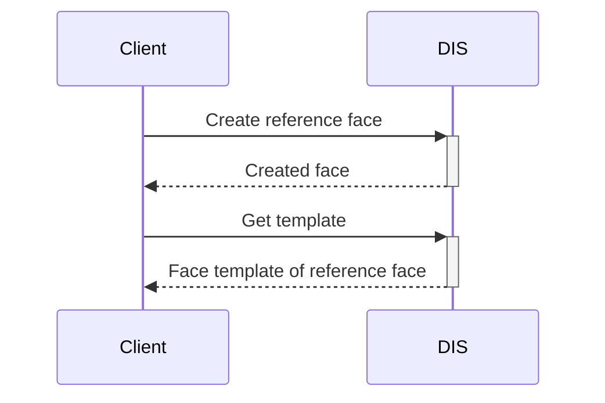
```mermaid
sequenceDiagram
    participant Client
    participant DIS

    Client->>+DIS: Create reference face
    DIS-->>-Client: Created face
    Client->>+DIS: Get template
    DIS-->>-Client: Face template of reference face
```

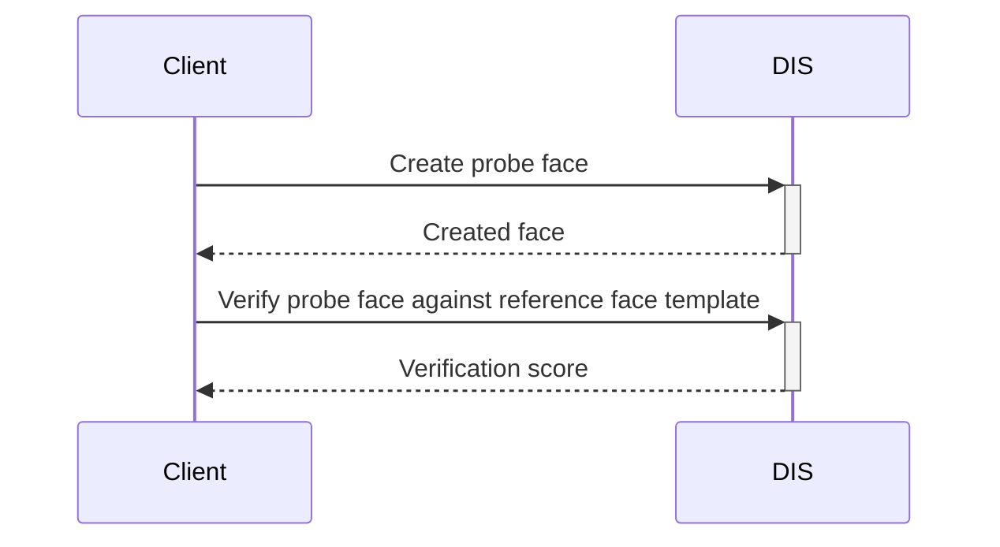
```mermaid
sequenceDiagram
    participant Client
    participant DIS

    Client->>+DIS: Create probe face
    DIS-->>-Client: Created face
    Client->>+DIS: Verify probe face against reference face template
    DIS-->>-Client: Verification score
```

#### Check Face Aspects
This sample show evaluation of aspects on detected face in custom age check. In sample, retrieved values
for age and gender are used in check against configured threshold. Age check is `true` if detected age is higher
than threshold. Detected Gender is by custom threshold decided to be `M` Male or `F` Female.

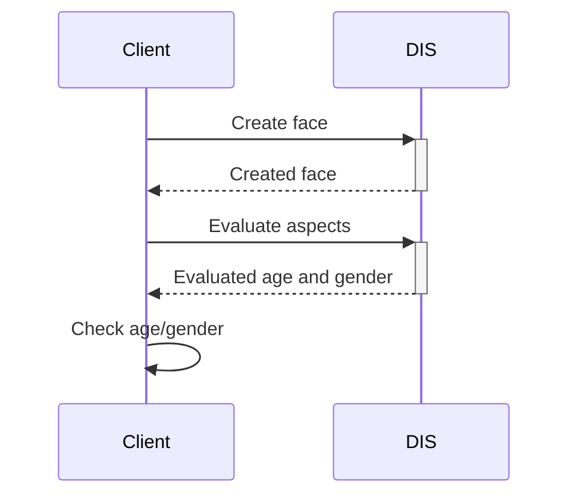
```mermaid
sequenceDiagram
    participant Client
    participant DIS

    Client->>+DIS: Create face
    DIS-->>-Client: Created face
    Client->>+DIS: Evaluate aspects
    DIS-->>-Client: Evaluated age and gender
    Client->>Client: Check age/gender
```

#### Create Face Image Crops
In this sample cropping functionalities of DIS are shown. First, face is detected on image under `sample-image-url`.
Crop Coordinates are evaluated for face returning coordinates under which face to be cropped can be found.
There is also information if face is fully in image.

Crop of face and crop with removed background are then requested and obtained.
Result images are stored under `./faceImageCropsOutput/croppedFaceImage.png` and `./faceImageCropsOutput/removedBackgroundFaceImage.png`.

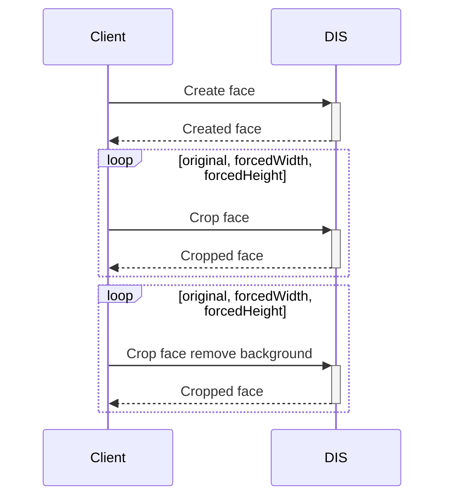
```mermaid
sequenceDiagram
    participant Client
    participant DIS

    Client->>+DIS: Create face
    DIS-->>-Client: Created face
    loop original, forcedWidth, forcedHeight
        Client->>+DIS: Crop face
        DIS-->>-Client: Cropped face
    end
    loop original, forcedWidth, forcedHeight
        Client->>+DIS: Crop face remove background
        DIS-->>-Client: Cropped face
    end
```

#### Evaluate Face Image Quality
Face Image Quality functionality returns set of evaluated attributes that can be used to create custom quality check
either from values provided in documentation or your own completely custom values. In this sample, documented values
for evaluating glasses are used (see DIS documentation). For selected attributes we check if they are in defined range
and if their preconditions are met (if preconditions are not met, attribute value is not reliable).

Face is detected on image under `sample-image-url`. Quality attributes are then obtained from recognized face and
from these, face confidence, yaw and pitch angle are evaluated by given conditions.

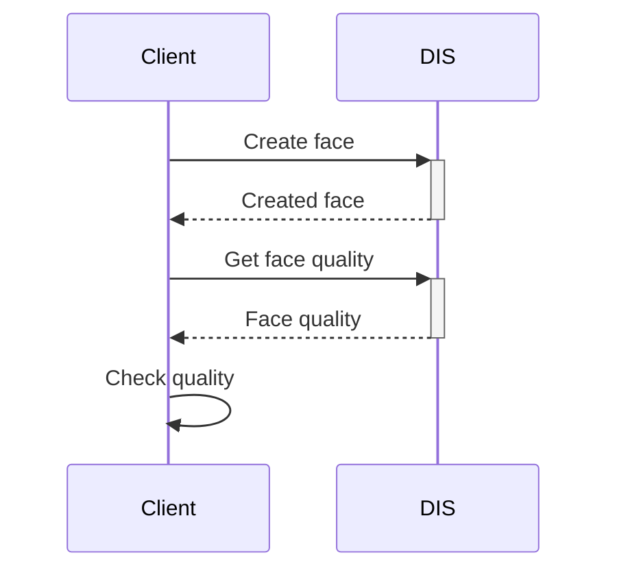
```mermaid
sequenceDiagram
    participant Client
    participant DIS

    Client->>+DIS: Create face
    DIS-->>-Client: Created face
    Client->>+DIS: Get face quality
    DIS-->>-Client: Face quality
    Client->>Client: Check quality
```

#### Check of Face Wearables (face mask, glasses, etc.)
In these samples, face is detected on image under `sample-image-url`. With requests on `/mask` and `/glasses` endpoints,
required scores for face-mask and glasses are returned and can be checked against custom threshold to decide if face
has these features.

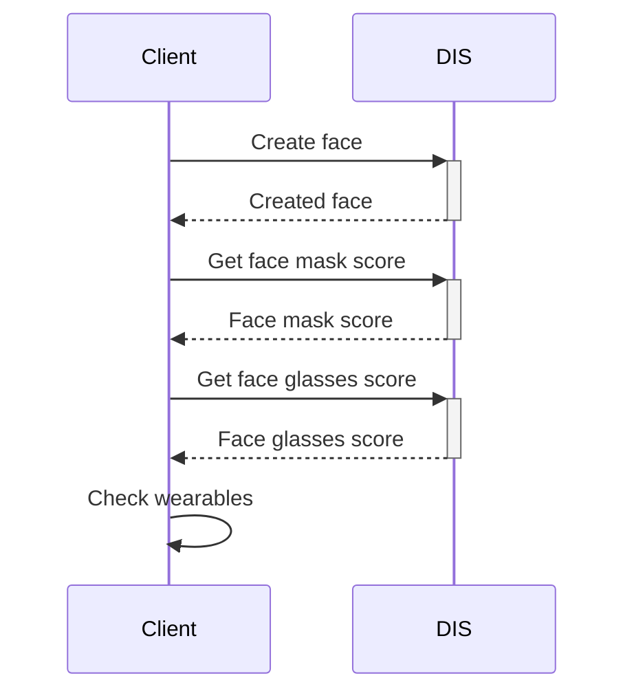
```mermaid
sequenceDiagram
    participant Client
    participant DIS

    Client->>+DIS: Create face
    DIS-->>-Client: Created face
    Client->>+DIS: Get face mask score
    DIS-->>-Client: Face mask score
    Client->>+DIS: Get face glasses score
    DIS-->>-Client: Face glasses score
    Client->>Client: Check wearables
```
