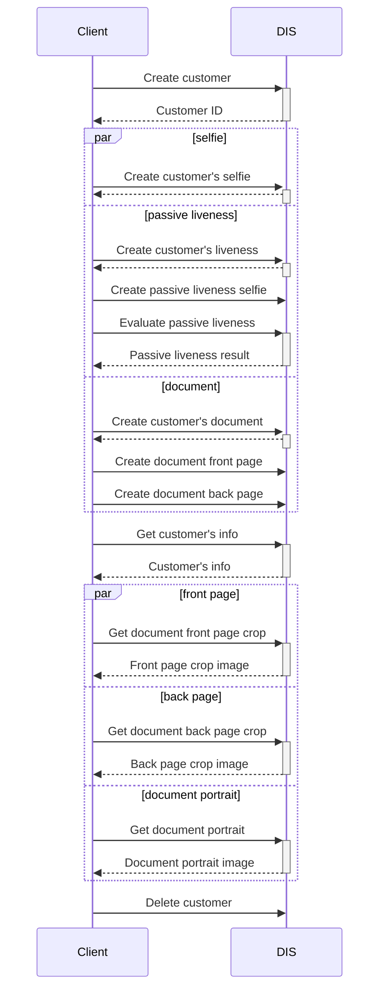
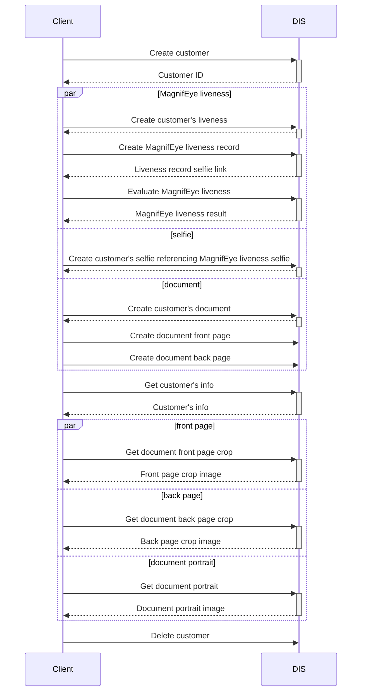
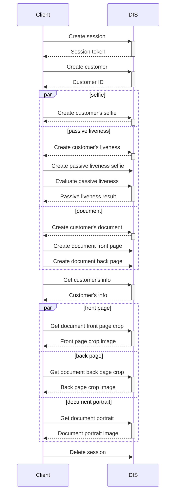

### Customer Onboarding
Customer onboarding serves for creating a digital identity of an individual called a customer. 
Onboarding aggregates all the data supplied by the client like selfies or document images 
which can be later used for inspecting the customer. This data is processed, the face is detected on the selfie, 
the document is classified, normalized and OCR is performed. Data is structured for straightforward inspection of the customer. 
Onboarding flow is customizable and only portion of the data can be supplied meeting the integrator's needs.

Following operations can be performed on the customer's data

Sample flow is shown in the sequence diagram below

### Customer Onboarding Workflow with MagnifEye Liveness
This sample shows alternative Customer Onboarding workflow. It follows the same concept as the workflow described above,
except it evaluates MagnifEye Liveness instead of Passive Liveness and the creation of customer selfie is performed later in the workflow.

When the customer is created, we create and evaluate MagnifEye liveness. Afterwards, the creation of customer selfie is performed by referencing the liveness selfie from the MagnifEye Liveness.
As the creation of MagnifEye Liveness record is performed by submitting a binary file produced by DOT components, it provides more security and ensures the selfies are produced by our components.

The sample workflow is shown in the diagram below

### Customer Onboarding Workflow with request sessions
This sample demonstrates Customer Onboarding workflow using request sessions, which ensure the provided data were created at the time of the onboarding.

Before the customer is created, session must be initialized, returning unique session token in the response. To create a customer linked to the session, the session token must be provided in the header.
Every subsequent request accessing this customer must have the same session token present in the header. 

While the onboarding flow is fully customizable, it is recommended that the submission of selfie, document pages and liveness data be in the form of binary files produced by DOT components to ensure the highest level of protection.
At the end of the onboarding process, the session is deleted, consequently deleting the linked customer as well.

The sample workflow is shown in the diagram below

