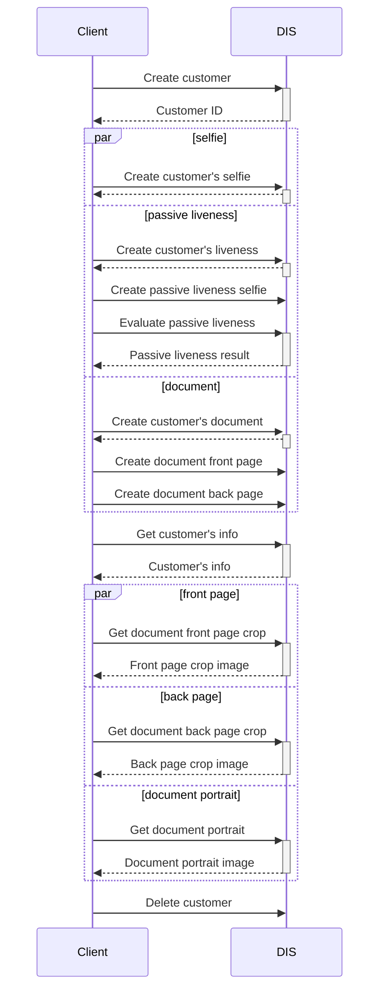

### Customer Onboarding
Customer onboarding serves for creating a digital identity of an individual called a customer. Onboarding aggregates all the data supplied by the client like selfies or document images which can be later used for inspecting the customer. This data is processed, the face is detected on the selfie, the document is classified, normalized and OCR is performed. Data is structured for straightforward inspection of the customer. Onboarding flow is customizable and only portion of the data can be supplied meeting the integrator's needs.

Following operations can be performed on the customer's data

Example flow is shown in the sequence diagram below

